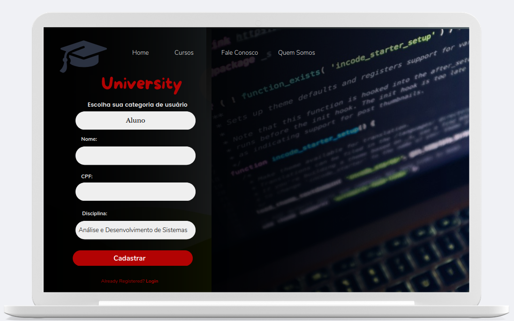
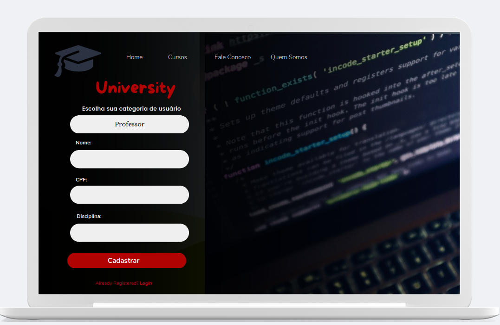

# Protótipo do Sistema - Segunda Entrega do Projeto Integrador  

Este repositório contém o desenvolvimento da **segunda entrega do Projeto Integrador (PI)**, que foca na **prototipação do sistema** com base na modelagem desenvolvida na primeira entrega.  

## 🎯 Objetivo  

A prototipação visa traduzir os conceitos formalizados anteriormente em **interfaces funcionais**, garantindo que os diagramas de caso de uso criados anteriormente sejam refletidos de maneira fiel e prática. Esta etapa é crucial para validar o fluxo das jornadas e alinhar a experiência do usuário ao que foi previamente planejado.

## 📋 Detalhes da Entrega  

De acordo com as orientações do projeto, os protótipos devem conter as seguintes jornadas principais:  

- **Cadastro de Pessoa Física**  
- **Cadastro de Pessoa Jurídica**  
- **Cadastro de Professores**  
- **Cadastro de Alunos**  

As interfaces foram projetadas considerando os **diagramas de caso de uso** e as melhores práticas de desenvolvimento, promovendo clareza e usabilidade para os usuários finais.  

## 💡 Benefícios da Prototipação com UML  

Para um(a) desenvolvedor(a) ou engenheiro(a) de software, o uso de **diagramas UML** durante o planejamento facilita a comunicação entre os membros da equipe e a tradução de ideias abstratas em representações visuais. Essa prática é fundamental para criar sistemas bem estruturados e compreensíveis.  

---

## 🖼️ Protótipos e Modelagens  

### 1. Protótipação Baixo Nível  
  

### 2. Protótipação Aluno  
  

### 3. Protótipação Professor  
  

### 4. Protótipação Pessoa Física  
  

### 5. Protótipação Pessoa Jurídica  
  

### 6. Diagrama de Caso de Uso  
  

### 7. Classe UML  
  
